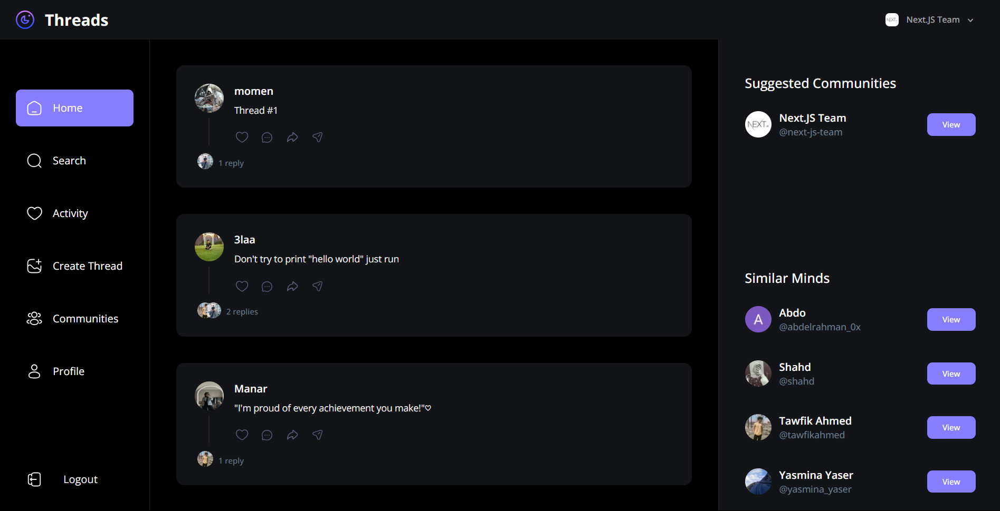

# Threads Clone - Social Media Platform 🌐

This is a clone of the popular social media platform **Threads**, built with modern technologies. The web app provides a full set of features, including user authentication, thread creation, profile management, and community building, designed with an elegant and responsive user interface.

## Technologies Used:

- ⚛️ **Next.js 15**: A powerful framework for building optimized, production-grade React apps.
- ⚛️ **ReactJS**: JavaScript library for building dynamic user interfaces.
- 🖋️ **TypeScript**: A statically typed superset of JavaScript, enhancing code quality and maintainability.
- 🎨 **Tailwind CSS**: Utility-first CSS framework for creating responsive and highly customizable designs.
- 🗄️ **MongoDB**: NoSQL database used for storing user data, threads, and other application-related content.
- 🔑 **Clerk**: Authentication provider offering secure login options, including Google, GitHub, and email.
- 🎨 **ShadCN**: A collection of beautifully designed, customizable UI components.
- 📦 **Uploadthing**: Used for handling image uploads and media management.

## Features:

- 🌐 **Fully Responsive Platform**: An engaging clone of Threads where users can interact, create threads, and reply to discussions from any device.
- 🔒 **Secure Authentication**: Supports login and sign-up through Clerk, with Google, GitHub, and email authentication options. ✨

- 💬 **Create and Engage with Threads**: Users can start new threads, comment on others' posts, and engage in meaningful conversations. 📝

- 📬 **Real-time Activity Notifications**: Get notified in real time when someone replies to your thread or mentions you in a discussion. 🔔

- ✏️ **Profile Customization**: Users can update their username, bio, and profile image to express themselves. 📸

- 👥 **Community Building**: Create and manage communities with customizable roles like admin and member for better access control. 🔑

- 🌟 **Elegant UI Design**: Designed with ShadCN components for a modern, polished, and consistent user experience.

---

Threads social media platform clone built with modern web technologies, offering users a secure and engaging experience for creating and managing threads, communities, and profiles.
